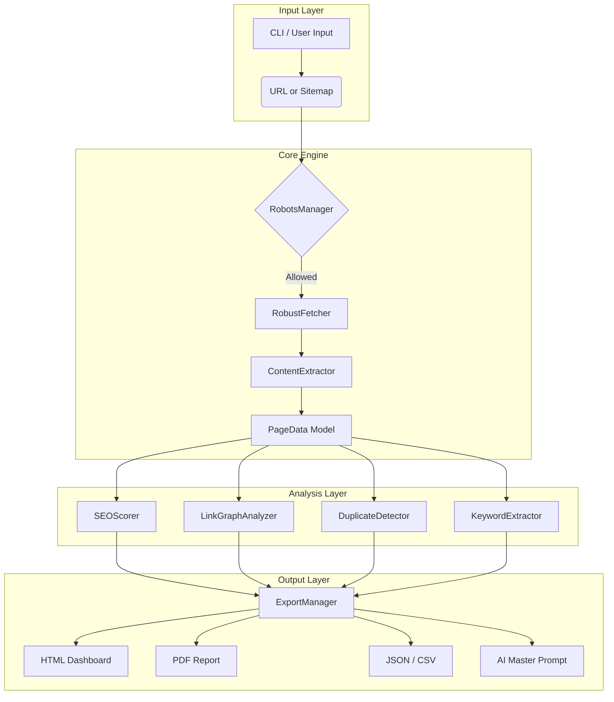

```markdown
# SEAR Architecture Deep Dive

This document provides a technical overview of SEAR's internal architecture, data flow, and design patterns.

## 🏗️ High-Level Overview

SEAR is designed as a modular, asynchronous pipeline. It separates concerns into distinct layers: **Fetching**, **Extraction**, **Analysis**, and **Reporting**.



## 🔄 Crawler Lifecycle
- **Initialization**: The user provides a seed URL. `main.py` initializes the `RobustFetcher` and `RobotsManager`.
- **Discovery**: If the URL is a sitemap, `SitemapParser` recursively extracts all `<loc>` URLs. If it's a homepage, it fetches the page and extracts internal links.
- **Fetching**: `RobustFetcher` uses `httpx` with an `asyncio.Semaphore` to limit concurrency. It handles retries, timeouts, and User-Agent rotation.
- **Extraction**: `ContentExtractor` uses BeautifulSoup to parse the HTML. It extracts metadata, headings, links, images, and structured data into a `PageData` Pydantic model.
- **Analysis**: Specialized modules (e.g., `CoreWebVitalsAnalyzer`, `FacetedNavigationAnalyzer`) process the `PageData` to append scores, issues, and metrics.
- **Reporting**: The `ExportManager` takes the aggregated data and renders it into the requested formats using Jinja2 (HTML), ReportLab (PDF), or standard libraries (CSV/JSON).

## ⚡ Async Architecture
SEAR leverages Python's `asyncio` for I/O-bound operations.
- **Concurrency**: Controlled via `asyncio.Semaphore` in `RobustFetcher` to prevent overwhelming target servers.
- **Non-blocking**: While waiting for HTTP responses, the event loop can process other URLs or parse already-fetched HTML.
- **Executor**: CPU-bound tasks (like complex regex matching or MinHash calculations) are offloaded to a thread pool using `loop.run_in_executor` to prevent blocking the event loop.

## 🤖 AI Pipeline
The AI pipeline does not call an LLM directly (to preserve privacy and avoid API costs). Instead, the AI Prompt Generator module:
1. Aggregates the `PageData` scores, issues, and competitor data.
2. Formats this data into a highly structured, context-rich prompt.
3. Outputs this prompt to the report. The user then copies this prompt into their preferred LLM (ChatGPT, Claude, etc.) to receive a tailored, step-by-step SEO action plan.

---

# SEAR Style Guide (`STYLE_GUIDE.md`)

To maintain a high-quality, enterprise-grade codebase, all contributors must adhere to the following style guidelines.

## 🐍 Python Style
- **Formatter**: We use [Black](https://github.com/psf/black) with a line length of 100.
- **Linter**: We use [Ruff](https://github.com/astral-sh/ruff) for fast, comprehensive linting.
- **Type Checking**: We use [MyPy](https://mypy.readthedocs.io/). All new code must be fully type-hinted.

## 📛 Naming Conventions
- **Variables/Functions**: `snake_case` (e.g., `fetch_page_data`, `total_issues`).
- **Classes**: `PascalCase` (e.g., `RobustFetcher`, `PageData`).
- **Constants**: `UPPER_SNAKE_CASE` (e.g., `MAX_RETRIES`, `SUPPORTED_SCHEMA_TYPES`).
- **Private Methods**: Prefix with a single underscore (e.g., `_validate_metadata`).

## 📁 Folder Organization
- Keep modules focused. A file should ideally not exceed 300-400 lines.
- Group related functionality into subdirectories (e.g., `analysis/`, `reports/`).
- All Pydantic models must reside in the `models/` directory.

## 📥 Imports
- Group imports in this order:
  1. Standard library
  2. Third-party libraries
  3. Local application modules
- Use absolute imports for clarity, except within the same package where relative imports are acceptable for `__init__.py`.

## 📝 Docstrings
- Use Google-style docstrings for all public classes and functions.
  ```python
  def calculate_score(page: PageData) -> int:
      """
      Calculate the overall SEO score for a given page.

      Args:
          page: The PageData object containing extracted metrics.

      Returns:
          An integer score between 0 and 100.
      """
  ```

## ⚠️ Error Handling
- **Never use bare `except:` clauses**. Catch specific exceptions (e.g., `except httpx.TimeoutException:`).
- **Log errors** using the standard `logging` module, not `print()`.
- **Fail gracefully**: If an analysis module fails, it should return default/empty data rather than crashing the entire crawl.

## 🧪 Testing
- All new features must include corresponding unit tests in the `tests/` directory.
- Use `pytest` and `pytest-asyncio` for asynchronous tests.
- Mock external network calls using `pytest-httpx` or `unittest.mock`.

---

# Development Guide (`DEVELOPMENT.md`)

This guide is for developers who want to set up a local development environment for SEAR, run tests, and contribute code.

## 🛠️ Setting Up the Environment

1. **Clone the repository**:
   ```bash
   git clone https://github.com/mahdiklidari190/SEAR.git
   cd SEAR
   ```
2. **Create and activate a virtual environment**:
   ```bash
   python -m venv venv
   source venv/bin/activate  # Windows: venv\Scripts\activate
   ```
3. **Install dependencies**:
   ```bash
   pip install -r requirements.txt
   pip install pytest pytest-asyncio black ruff mypy  # Dev dependencies
   ```

## 🧹 Linting and Formatting
Before committing, ensure your code is formatted and passes linting checks:
```bash
# Format code
black .

# Lint code
ruff check .

# Type checking
mypy .
```
*Tip: Consider installing pre-commit hooks to automate this.*

## 🧪 Running Tests
Run the test suite using pytest:
```bash
pytest -v
```
To check test coverage:
```bash
pytest --cov=core --cov=analysis --cov-report=term-missing
```

## 🐛 Debugging
- Use the built-in `logging` module. Set the log level to `DEBUG` in `main.py` to see detailed network and parsing logs.
- For debugging the HTML dashboard, you can modify the Jinja2 templates in `reports/html_dashboard.py` and refresh your browser.

## 📋 GitHub Project Board
We use a Kanban-style project board to track progress. Columns include:
- **Ideas**: Backlog of potential features.
- **Ready**: Tasks that are well-defined and ready to be picked up.
- **In Progress**: Tasks currently being worked on.
- **Review**: Pull requests awaiting review.
- **Testing**: Code merged into the `develop` branch, undergoing QA.
- **Done**: Completed and ready for the next release.

---

# Code Owners (`CODEOWNERS`)

```text
# Code Owners for SEAR
# This file defines the individuals or teams that are responsible for code in specific directories.

# Default owners for everything in the repo
*       @mahdiklidari190

# Core crawling and fetching logic
/core/  @mahdiklidari190

# SEO Analysis modules
/analysis/ @mahdiklidari190

# Data models and type definitions
/models/ @mahdiklidari190

# Reporting and Export generators
/reports/ @mahdiklidari190

# Documentation files
*.md    @mahdiklidari190
```
