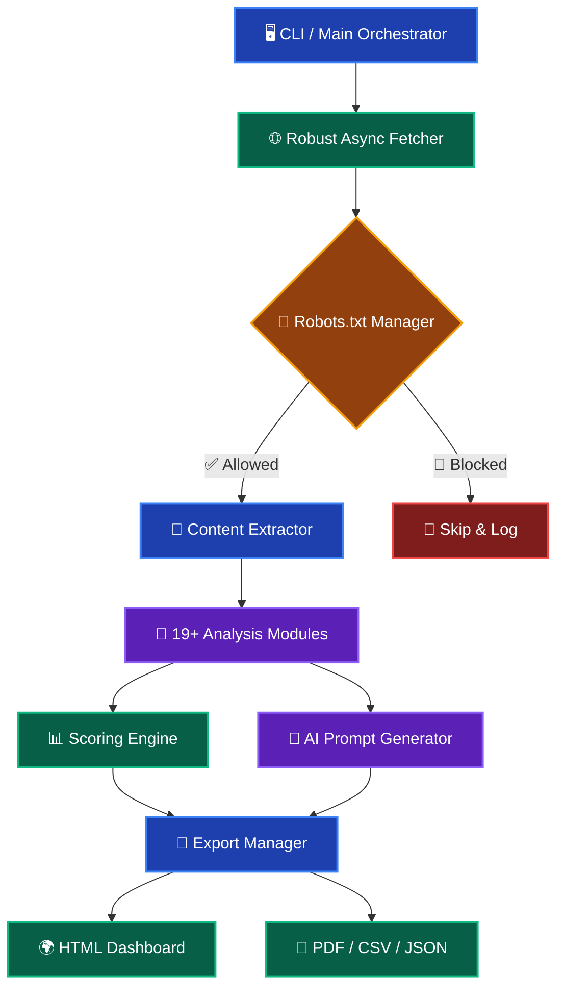

# SEAR
### Smart Enterprise Analysis & Reporting

<br>

[](https://www.python.org/)
[](https://www.apache.org/licenses/LICENSE-2.0)
[](https://github.com/psf/black)
[](https://mypy.readthedocs.io/)
[](https://github.com/mahdiklidari190/SEAR)
[](https://github.com/mahdiklidari190/SEAR)
[](https://github.com/mahdiklidari190/SEAR/pulls)
[](https://github.com/mahdiklidari190/SEAR/stargazers)
[](https://github.com/mahdiklidari190/SEAR/network/members)
[](https://github.com/mahdiklidari190/SEAR/discussions)

<br>

**An enterprise-grade, open-source SEO intelligence platform.**  
**A powerful, free, and privacy-first alternative to Ahrefs, SEMrush, and Screaming Frog.**

<br>

[🚀 Quick Start](#-4-installation) •
[📖 Documentation](#-1-project-overview) •
[🤖 AI Features](#-7-ai-analysis-engine) •
[🤝 Contributing](#-13-contributing--community) •
[🇮🇷 مستندات فارسی](#-مستندات-فارسی)

</div>

<br>

---

## 📸 Visual Overview

<div align="center">

| Interactive HTML Dashboard | Terminal Crawling Progress |
| :---: | :---: |
|  |  |
| *Comprehensive, actionable visual reports* | *Real-time, rich terminal progress tracking* |

</div>

---

<br>

# 🇬🇧 English Documentation

<br>

## 📖 1. Project Overview

> *"Enterprise-level SEO auditing shouldn't cost hundreds of dollars a month, nor should it require sacrificing your data privacy to third-party cloud servers."*

**SEAR** (Smart Enterprise Analysis & Reporting) is a comprehensive, modular, and asynchronous SEO analysis platform built in Python. It solves the problem of fragmented SEO workflows by combining deep crawling, graph analysis, Core Web Vitals estimation, and AI-driven recommendations into a single, cohesive experience.

Unlike traditional tools that rely on massive, outdated cloud databases, SEAR performs **real-time, on-demand analysis** directly from your machine. 

### 🧠 Project Philosophy
We believe that powerful technical analysis should be accessible, transparent, and controllable. SEAR is built on the principle that developers and SEO professionals deserve tooling that adapts to their workflow, not the other way around.

### 🌍 Why Open Source
- **Transparency**: Every algorithm, scoring metric, and data extraction method is visible and auditable.
- **Community-Driven**: Features are shaped by real-world use cases from SEO professionals and developers worldwide.
- **No Vendor Lock-in**: Export your data in any format. You own your insights.

### 🔒 Why Privacy First
- **100% Data Privacy**: Your crawl data, internal link structures, and business metrics never leave your local environment or private infrastructure.
- **Compliance Ready**: Ideal for enterprises operating under strict GDPR, HIPAA, or internal data sovereignty policies.

### 🏢 Enterprise Design Goals
1. **Modularity**: Plug-and-play architecture allowing custom analysis modules.
2. **Scalability**: Async-first design capable of handling thousands of URLs efficiently.
3. **Extensibility**: Rich API and configuration options for CI/CD pipeline integration.

---

## 🚀 2. Key Features & Module Overview

SEAR is packed with **37+ enterprise-level features** designed for SEO professionals, developers, and agencies.

| Category | Feature | Description |
| :--- | :--- | :--- |
| **🎯 Core** | **SEO Analysis** | Comprehensive on-page and off-page scoring across 10 dimensions. |
| | **Technical SEO** | Deep server, header, protocol, and security analysis. |
| | **Crawl Budget** | Detects wasted budget, duplicates, parameters, and spider traps. |
| **🔗 Links** | **Internal Link Graph** | Visualizes site architecture and authority flow using NetworkX. |
| | **Orphan Pages** | Identifies pages with zero internal inbound links. |
| | **Broken Links** | Detects 404, 410, 500, 502, 503, and DNS errors. |
| | **Redirect Chains** | Maps 301, 302, 307, 308 chains and infinite loops. |
| **✅ Validation** | **Robots & Sitemap** | Validates syntax, rules, and XML/Image/Video sitemaps. |
| | **Schema & Breadcrumbs** | Validates JSON-LD for 13+ schema types and hierarchy. |
| **⚡ Performance** | **Core Web Vitals** | Estimates LCP, CLS, INP, FCP, TBT, and TTFB from HTML. |
| | **Security & SSL** | Checks HSTS, CSP, X-Frame-Options, and TLS expiry. |
| | **JS Rendering** | Detects React, Vue, Angular, Next.js, and Nuxt signatures. |
| **📝 Content** | **Similarity Detection** | Uses MinHash/SimHash and Shingling for near-duplicate detection. |
| | **Competitor Analysis** | Auto-discovers top SERP competitors via search APIs. |
| **🔌 Integrations** | **GSC & GA4** | Optional OAuth integration for CTR, clicks, and engagement. |
| | **Backlink APIs** | Optional connectors for Ahrefs, SEMrush, Moz, DataForSEO. |
| **📊 Reporting** | **Multi-Format Export** | Generates TXT, JSON, CSV, PDF, and interactive HTML dashboards. |
| | **AI Master Prompt** | Generates a massive, ready-to-use prompt for LLMs (GPT-4/Claude). |

---

## ⚔️ 3. Feature Comparison

| Feature | SEAR (This Project) | Ahrefs / SEMrush | Screaming Frog |
| :--- | :---: | :---: | :---: |
| **Cost** | 🟢 **Free & Open Source** | 🔴 $100–$500+/mo | 🟡 $259/yr |
| **Data Privacy** | 🟢 **100% Local / Private** | 🔴 Cloud-based | 🟢 Local |
| **Real-Time Data** | 🟢 **Live Crawling** | 🟡 Cached Database | 🟢 Live Crawling |
| **AI Integration** | 🟢 **Built-in Master Prompt** | 🔴 Limited / Add-on | 🔴 None |
| **Customization** | 🟢 **Fully Extensible** | 🔴 Closed Source | 🔴 Closed Source |
| **Persian NLP** | 🟢 **Native Support** | 🟡 Basic | 🔴 None |
| **HTTP/2 Support** | 🟢 **Yes** | 🟡 Varies | 🟡 Limited |
| **CI/CD Ready** | 🟢 **Yes (CLI/JSON)** | 🟡 Limited | 🔴 No |

---

## 🏗️ Architecture Overview



---

## ⚙️ 4. Installation

> [!TIP]
> **Prerequisites**: Python 3.10 or higher is required. Ensure you have `git` installed.

### Supported Platforms
- 🪟 **Windows** (10/11, PowerShell/WSL)
- 🍎 **macOS** (Intel & Apple Silicon)
- 🐧 **Linux** (Ubuntu, Debian, CentOS, Arch)

```bash
# 1. Clone the repository
git clone https://github.com/mahdiklidari190/SEAR.git
cd SEAR

# 2. Create a virtual environment
python -m venv venv

# 3. Activate the virtual environment
# Windows:
venv\Scripts\activate
# macOS/Linux:
source venv/bin/activate

# 4. Install dependencies
pip install -r requirements.txt

# 5. (Optional) Copy environment variables template
cp .env.example .env
```

---

## 💡 5. Quick Start & CLI Usage

```bash
# Run the interactive CLI
python main.py

# Or pass arguments directly for automated pipelines
python main.py --url https://example.com --export html,pdf --max-pages 1000
```

**Typical Workflow:**
1. Enter the target URL or Sitemap URL when prompted.
2. The engine automatically detects the sitemap, queues pages, and begins asynchronous analysis.
3. Watch real-time progress bars powered by `rich`.
4. Upon completion, SEAR automatically opens `report.html` in your default web browser.

---

## ⚙️ 6. Configuration

SEAR is highly configurable via `sear_config.json` or environment variables (`.env`):

```json
{
  "max_concurrent_requests": 10,
  "request_timeout": 30,
  "max_pages": 5000,
  "user_agent": "SEAR-Bot/1.0 (+https://github.com/mahdiklidari190/SEAR)",
  "search_console": {
    "client_id": "your_client_id",
    "client_secret": "your_client_secret",
    "refresh_token": "your_refresh_token",
    "property_url": "https://example.com/"
  }
}
```

> [!WARNING]
> **Security Notice**: Never commit your `.env` or `sear_config.json` with real API keys to a public repository. Always use `.env.example` as a template.

---

## 🤖 7. AI Analysis Engine

SEAR doesn't just find problems; it prepares the solution. The **AI Master Prompt** aggregates:
- 📊 Raw website data & technical metrics
- 🎯 SEO scores across 10 dimensions
- 🏆 Competitor context & SERP positioning
- 💻 Specific code snippets (e.g., corrected JSON-LD, optimized meta tags)

This outputs a single, massive, highly structured prompt that, when fed to an LLM (like GPT-4, Claude 3, or local models via Ollama), generates a step-by-step, implementation-ready SEO action plan.

---

## 🔄 8. Analysis Pipeline

| Step | Phase | Description |
| :---: | :--- | :--- |
| **1️⃣** | **Discovery** | Seed URL or Sitemap is parsed and validated. |
| **2️⃣** | **Fetching** | `RobustFetcher` handles concurrent, resilient HTTP requests with exponential backoff retry logic. |
| **3️⃣** | **Extraction** | `ContentExtractor` parses HTML, extracting metadata, links, images, and structured data. |
| **4️⃣** | **Analysis** | 19+ specialized modules evaluate Technical SEO, Content, Performance, and Security. |
| **5️⃣** | **Scoring** | A multi-dimensional scoring engine calculates an overall health score (0-100). |
| **6️⃣** | **Reporting** | Data is compiled into beautiful, actionable, multi-format reports. |

---

## 📂 9. Project Structure

```text
SEAR/
├── main.py                     # Entry point and CLI orchestrator
├── requirements.txt            # Python dependencies
├── .env.example                # Environment variable template
├── sear_config.json            # Optional API keys and settings
├── config/                     # Configuration, constants, and settings
├── models/                     # Pydantic data models for type safety
├── core/                       # Fetcher, parser, extractor, scorer
├── analysis/                   # 19+ specialized SEO analysis modules
├── keywords/                   # Keyword extraction and Persian NLP processing
├── competitors/                # Competitor discovery engine (DDG/Selenium)
├── integrations/               # GSC, GA4, and Backlink API connectors
├── reports/                    # TXT, JSON, CSV, PDF, HTML generators
├── ai/                         # AI Master Prompt generator
└── utils/                      # Helper functions and dependency checks
```

---

## 📦 10. Dependencies

| Dependency | Purpose |
| :--- | :--- |
| `httpx` | Async HTTP client with HTTP/2 support for blazing-fast fetching. |
| `pydantic` | Robust data validation and settings management. |
| `beautifulsoup4` & `lxml` | Powerful and forgiving HTML/XML parsing. |
| `rich` | Beautiful terminal output, progress bars, and formatted tables. |
| `tenacity` | Robust retry logic for handling network timeouts gracefully. |
| `networkx` | Graph theory library for internal link mapping and orphan page detection. |
| `datasketch` | MinHash and LSH algorithms for near-duplicate content detection. |
| `jinja2` | Templating engine for generating the dynamic HTML dashboard. |
| `reportlab` | PDF document generation for professional client reports. |

---

## ⚡ 11. Performance & Privacy Highlights

> [!IMPORTANT]
> **Privacy by Design**: 100% of the crawling, processing, and analysis happens locally on your machine. No telemetry, no hidden cloud uploads.

- 🚀 **Blazing Fast**: Built on `httpx` with HTTP/2 support and `asyncio` concurrency, outperforming traditional synchronous crawlers.
- 💾 **Resource Efficient**: Intelligent connection pooling, streaming responses, and memory management for large-scale crawls (10,000+ pages).
- 🔒 **Zero Data Leakage**: Your site architecture, unpublished URLs, and internal metrics remain strictly within your control.

---

## 🗺️ 12. Roadmap & Future Vision

### ✅ Completed
- [x] Core asynchronous crawling engine & 24+ technical checks
- [x] Multi-format export (TXT, JSON, CSV, PDF, HTML) & AI Prompt
- [x] Google Search Console & Analytics OAuth integration
- [x] Native Persian NLP and MinHash duplicate detection

### 🔲 In Progress & Future Vision
- [ ] Automated CI/CD testing pipeline & 95%+ test coverage
- [ ] FastAPI backend for optional cloud-based dashboard hosting
- [ ] React-based frontend dashboard replacement
- [ ] Distributed crawling support (Redis/Celery) for enterprise-scale sites
- [ ] Browser automation (Playwright) integration for JavaScript-heavy SPAs

---

## 🤝 13. Contributing & Community

We welcome contributions! SEAR is designed to be modular, making it easy to add new analysis modules, integrations, or report formats.

### 🛠️ How to Contribute
1. **Fork** the repository.
2. **Clone** your fork: `git clone https://github.com/YOUR_USERNAME/SEAR.git`
3. **Create a branch**: `git checkout -b feature/AmazingFeature`
4. **Commit** your changes: `git commit -m 'Add some AmazingFeature'`
5. **Push** to the branch: `git push origin feature/AmazingFeature`
6. **Open a Pull Request**.

> [!NOTE]
> Please read our [CONTRIBUTING.md](https://github.com/mahdiklidari190/SEAR/blob/main/CONTRIBUTING.md) for details on our code of conduct, development setup, and testing guidelines.

### 🌟 Community Links
- 🐛 **Issues**: Report bugs or request features ([Open an Issue](https://github.com/mahdiklidari190/SEAR/issues))
- 🌟 **Good First Issues**: Look for the [`good first issue`](https://github.com/mahdiklidari190/SEAR/issues?q=is%3Aissue+is%3Aopen+label%3A%22good+first+issue%22) label to get started.
- 🆘 **Help Wanted**: Check out [`help wanted`](https://github.com/mahdiklidari190/SEAR/issues?q=is%3Aissue+is%3Aopen+label%3A%22help+wanted%22) tasks for high-impact contributions.
- 💬 **Discussions**: Join the conversation in [GitHub Discussions](https://github.com/mahdiklidari190/SEAR/discussions).
- 📋 **Tasks**: View our active development board in [TASKS.md](https://github.com/mahdiklidari190/SEAR/blob/main/TASKS.md).

---

## ❓ 14. FAQ

<details>
<summary><strong>Is SEAR really free for commercial use?</strong></summary>
<br>
Yes. SEAR is licensed under the Apache 2.0 License, which permits free use, modification, and distribution, even for commercial purposes, provided the license and copyright notices are retained.
</details>

<details>
<summary><strong>Can I run SEAR on a server or in a CI/CD pipeline?</strong></summary>
<br>
Absolutely. SEAR is designed with CLI-first automation in mind. You can output results to JSON or CSV and integrate it directly into GitHub Actions, GitLab CI, or custom cron jobs.
</details>

<details>
<summary><strong>Does SEAR support JavaScript-rendered pages (SPAs)?</strong></summary>
<br>
The core engine analyzes the initial HTML response. For heavy JavaScript frameworks (React, Vue, Next.js), we recommend ensuring your site has proper SSR/SSG or using the planned Playwright integration (see Roadmap).
</details>

<details>
<summary><strong>How does the Persian NLP support work?</strong></summary>
<br>
SEAR includes specialized tokenization, stop-word removal, and keyword extraction pipelines optimized for the Persian (Farsi) language, making it uniquely powerful for Iranian and Middle Eastern markets.
</details>

---

## 🔧 15. Troubleshooting

| Issue | Possible Cause | Solution |
| :--- | :--- | :--- |
| `ModuleNotFoundError` | Dependencies not installed | Run `pip install -r requirements.txt` in an activated virtual environment. |
| `SSL: CERTIFICATE_VERIFY_FAILED` | Outdated local certificates | Update `certifi` package or check corporate firewall/proxy settings. |
| Crawling is too slow | Rate limiting by target server | Reduce `max_concurrent_requests` in `sear_config.json` and increase `request_timeout`. |
| HTML report is empty | No pages were successfully crawled | Check `robots.txt` permissions and ensure the target URL is accessible. |

---

## 🛡️ 16. Security Policy Summary

We take the security of SEAR and its users seriously. 
- **Vulnerability Reporting**: Please do not report security vulnerabilities through public GitHub issues. Instead, refer to our [SECURITY.md](https://github.com/mahdiklidari190/SEAR/blob/main/SECURITY.md) for instructions on how to responsibly disclose vulnerabilities.
- **Dependencies**: We regularly audit and update dependencies using `pip-audit` and Dependabot.
- **Secrets**: Never hardcode API keys. Always use the provided `.env` mechanism.

---

## 🚀 17. Release Strategy

SEAR follows [Semantic Versioning](https://semver.org/) (MAJOR.MINOR.PATCH):
- **MAJOR**: Incompatible API or configuration changes.
- **MINOR**: New features, modules, or integrations (backward compatible).
- **PATCH**: Bug fixes, performance improvements, and documentation updates.

View the complete history in our [CHANGELOG.md](https://github.com/mahdiklidari190/SEAR/blob/main/CHANGELOG.md).

---

## 🌟 18. Sponsors, Contributors & Community

### 💖 Sponsors
SEAR is an open-source project sustained by community effort. If your company benefits from SEAR, consider becoming a sponsor to help us maintain and accelerate development.
<br>


### 👥 Contributors
A huge thank you to everyone who has contributed code, documentation, or feedback!
<br>
<a href="https://github.com/mahdiklidari190/SEAR/graphs/contributors">
  
</a>

### 📈 Star History
If you find SEAR useful, please consider giving it a ⭐️ on GitHub! It helps the project grow and reach more developers.
<br>


---

## 📜 19. License & Acknowledgements

**SEAR** is open-source software licensed under the [Apache License 2.0](https://www.apache.org/licenses/LICENSE-2.0).

### Acknowledgements
- Built with ❤️ by [Bardia Klidari](https://github.com/mahdiklidari190) and the open-source community.
- Special thanks to the developers of `httpx`, `rich`, `pydantic`, and `networkx` for providing the foundational tools that make SEAR possible.
- Proudly associated with and supported by the **Dark Wolf Agency**.

---

## 🔗 20. Connect & Support

<div align="center">

| Platform | Link |
| :--- | :--- |
| 🌐 **Website** | [klidari.ir](https://klidari.ir/) |
| 💻 **GitHub Profile** | [@mahdiklidari190](https://github.com/mahdiklidari190) |
| 💼 **LinkedIn** | [Bardia Klidari](https://www.linkedin.com/in/bardia-klidari-64a32a30b?originalSubdomain=ir) |
| 📂 **Repository** | [github.com/mahdiklidari190/SEAR](https://github.com/mahdiklidari190/SEAR) |

<br>

**Made with precision, built for the enterprise.**  
*Empowering your SEO workflow, one crawl at a time.*

</div>

---

<br>

# 🇮🇷 مستندات فارسی

<div align="center">
  
> **پلتفرم هوشمند تحلیل و گزارش‌دهی سئو در سطح سازمانی**  
> یک جایگزین قدرتمند، رایگان و مبتنی بر حریم خصوصی برای ابزارهایی مانند Ahrefs، SEMrush و Screaming Frog.

</div>

### ✨ ویژگی‌های کلیدی
- 🔒 **حریم خصوصی ۱۰۰٪**: تمام داده‌های شما به صورت محلی پردازش می‌شوند و هرگز به سرورهای ابری شخص ثالث ارسال نمی‌شوند.
- ⚡ **سرعت بالا**: معماری ناهمگام (Async) با پشتیبانی از HTTP/2 برای خزش فوق‌سریع.
- 🇮🇷 **پشتیبانی بومی از زبان فارسی**: پردازش زبان طبیعی (NLP) بهینه‌شده برای متون فارسی، شامل حذف stopwords و استخراج کلمات کلیدی.
- 🤖 **موتور تحلیل مبتنی بر هوش مصنوعی**: تولید خودکار پرامپت‌های حرفه‌ای برای مدل‌های زبانی بزرگ (LLM) جهت دریافت راهکارهای عملی سئو.
- 📊 **گزارش‌دهی چندفرمتی**: خروجی گرفتن به صورت HTML تعاملی، PDF، CSV، JSON و TXT.

### 🚀 شروع سریع
```bash
git clone https://github.com/mahdiklidari190/SEAR.git
cd SEAR
python -m venv venv
source venv/bin/activate  # در ویندوز: venv\Scripts\activate
pip install -r requirements.txt
python main.py
```

> [!نکته]
> برای مشاهده مستندات کامل فنی، راهنمای مشارکت و جزئیات پیکربندی، لطفاً به بخش انگلیسی همین صفحه یا فایل‌های [CONTRIBUTING.md](https://github.com/mahdiklidari190/SEAR/blob/main/CONTRIBUTING.md) و [ROADMAP.md](https://github.com/mahdiklidari190/SEAR/blob/main/ROADMAP.md) مراجعه کنید.

---

<div align="center">
  <sub>© 2026 SEAR Project. Licensed under Apache 2.0.</sub>
</div>
